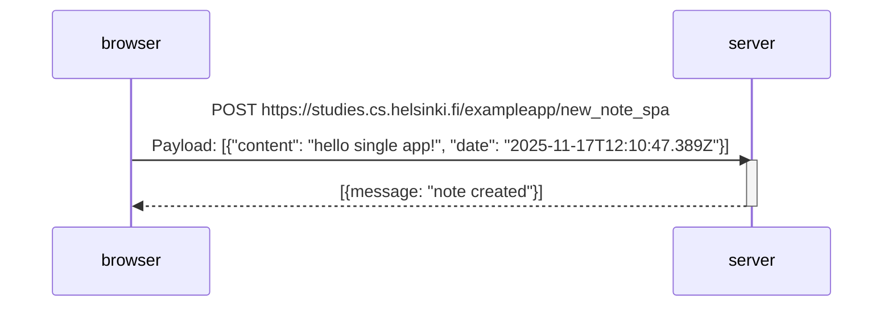

```mermaid
sequenceDiagram
    participant browser
    participant server

    browser->>server: POST https://studies.cs.helsinki.fi/exampleapp/new_note_spa <br/><br/>Payload: [{"content": "hello single app!", "date": "2025-11-17T12:10:47.389Z"}]
    activate server
    server-->>browser: [{message: "note created"}]
    deactivate server
```
